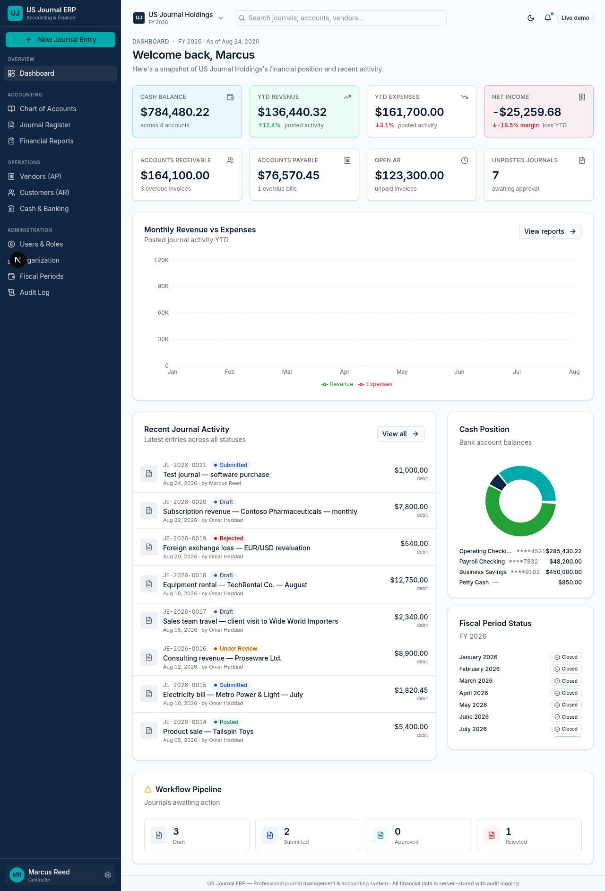

# US Journal ERP

**Professional journal management and accounting ERP — installable on your PC.**

US Journal ERP is a production-grade accounting system built for growing businesses. It runs as a desktop application (Windows / macOS / Linux) with all financial data stored locally in an encrypted SQLite database — no cloud dependency, no data leaving your machine.



---

## Key Features

### Accounting
- **General Ledger** with hierarchical chart of accounts (Asset / Liability / Equity / Revenue / Expense)
- **Journal Management** with full approval workflow: `Draft → Submitted → Under Review → Approved → Posted → Reversed`
- **Reversal journals** — posted journals cannot be edited, only corrected through atomic reversal entries
- **Fiscal periods** with open/close controls — closed periods reject new postings
- **Server-side validation** — totals are recomputed on the server, never trusting client input

### Financial Reports
- Trial Balance (with debit/credit ending balances)
- Balance Sheet (Assets = Liabilities + Equity, with balanced indicator)
- Income Statement (Revenue − COGS = Gross Profit − Operating Expenses = Operating Income ± Other = Net Income)
- Cash Flow Statement (indirect method — Operating / Investing / Financing)

### Operations
- **Vendors (AP)** — vendor aging buckets (Current / 1-30 / 31-60 / 61-90 / 90+ days)
- **Customers (AR)** — customer aging + credit utilization warnings
- **Cash & Banking** — bank accounts with reconciliation status per transaction
- **Audit Log** — every material action recorded with user + timestamp

### Security
- **Session-based authentication** with bcrypt-hashed passwords (HTTP-only cookies, 7-day expiry, revocable)
- **6 role types**: Administrator, Controller, Approver, Accountant, Auditor, Viewer
- **Every API route requires authentication** — returns 401 if no session
- **Audit trail** for journal create / submit / approve / reject / post / reverse / period close

### Desktop Application
- **Electron-based** — runs on Windows, macOS, and Linux
- **Bundled Next.js standalone server** — no internet connection required
- **Local SQLite database** — stored in OS-specific userData path
- **Single-installer distribution** — `.exe` (Windows), `.dmg` (macOS), `.AppImage` (Linux)

---

## Demo Login Credentials

After seeding the database, the following accounts are available:

| Role          | Email                         | Password         |
|---------------|-------------------------------|------------------|
| Administrator | admin@usjournal.test          | Admin@2026       |
| Controller    | controller@usjournal.test    | Control@2026     |
| Approver      | approver@usjournal.test       | Approve@2026     |
| Accountant    | accountant@usjournal.test     | Accounts@2026    |
| Auditor       | auditor@usjournal.test        | Audit@2026       |
| Viewer        | viewer@usjournal.test         | View@2026        |

**Change these passwords in production** via the Users & Roles screen.

---

## Tech Stack

| Layer | Technology |
|-------|-----------|
| Framework | Next.js 16 (App Router, Turbopack) |
| Language | TypeScript 5 |
| UI | Tailwind CSS 4 + shadcn/ui (New York) |
| Charts | Recharts |
| Icons | lucide-react |
| Database | Prisma ORM + SQLite |
| Auth | bcryptjs + session cookies |
| Desktop | Electron 43 + electron-builder 26 |
| State | Zustand |
| Toasts | sonner |

---

## Getting Started (Development)

### Prerequisites

- **Node.js 20+**
- **Bun** (install from https://bun.sh)

### Setup

```bash
# Clone the repo
git clone https://github.com/mahmoudmohamedxx1-hue/US-Journal-ERP.git
cd US-Journal-ERP

# Install dependencies
bun install

# Initialize the database (creates SQLite file + schema)
bun run db:push

# Seed demo data (users, accounts, journals, vendors, customers)
bun run seed

# Start the dev server
bun run dev
```

Open `http://localhost:3000` and sign in with any of the demo credentials above.

---

## Building Desktop Installers

### Windows installer (.exe)

```bash
bun run dist:win
```

Produces `release/USJournalERP-Setup-1.0.0.exe` (NSIS installer).

### macOS (.dmg)

```bash
bun run dist:mac
```

Produces `release/USJournalERP-1.0.0.dmg` (DMG image).

### Linux (.AppImage + .tar.gz)

```bash
bun run dist:linux
```

Produces `release/USJournalERP-1.0.0.AppImage` (single-file portable app).

**See [`BUILD.md`](BUILD.md) for full build instructions, code signing, and troubleshooting.**

---

## Project Structure

```
US-Journal-ERP/
├── electron/
│   ├── main.ts              # Electron main process
│   ├── preload.ts           # Preload script (contextBridge)
│   ├── tsconfig.json        # Separate TS config for Electron
│   └── dist/                # Compiled JS (gitignored)
├── prisma/
│   └── schema.prisma        # 20+ models: User, Session, Organization, Account, Journal, JournalLine, JournalApproval, Vendor, Customer, Bill, Invoice, BankAccount, TaxCode, Department, Location, Project, FiscalYear, FiscalPeriod, AuditLog, etc.
├── scripts/
│   ├── seed.ts              # Database seeding
│   └── migrate-auth.py     # Auth migration helper
├── src/
│   ├── app/
│   │   ├── api/             # Next.js API routes (auth, journals, reports, etc.)
│   │   ├── layout.tsx       # Root layout
│   │   └── page.tsx         # Main page (auth gating + view switcher)
│   ├── components/
│   │   ├── erp/             # ERP-specific components
│   │   │   ├── app-shell.tsx
│   │   │   ├── kpi-card.tsx
│   │   │   ├── status-badge.tsx
│   │   │   ├── account-combobox.tsx
│   │   │   ├── balance-indicator.tsx
│   │   │   ├── currency-input.tsx
│   │   │   ├── confirm-dialog.tsx
│   │   │   ├── empty-state.tsx
│   │   │   └── views/       # View modules (Dashboard, Journals, Reports, etc.)
│   │   └── ui/              # shadcn/ui primitives
│   └── lib/
│       ├── api.ts           # API helpers (session-aware)
│       ├── auth.ts          # Session-based auth
│       ├── db.ts            # Prisma client singleton
│       ├── format.ts        # Money/date formatting
│       └── erp-store.ts    # Zustand store for view state
├── build/
│   └── icons/               # App icons (PNG, multiple sizes)
├── electron-builder.win.yml # Windows packaging config
├── electron-builder.mac.yml # macOS packaging config
├── package.json             # Build config (Linux) + npm scripts
├── BUILD.md                 # Full build guide
└── README.md                # This file
```

---

## Accounting Rules Enforced

- ✅ Total debits must equal total credits before submit/post (recomputed server-side)
- ✅ Debit and credit cannot both be entered on one line
- ✅ Amounts must be positive
- ✅ Posted journals cannot be edited — corrections require reversal journals
- ✅ Closed fiscal periods reject new postings
- ✅ Reversal journals are atomic (database transaction)
- ✅ Audit log entries created for every workflow action

---

## Modules

| Module | Description |
|--------|-------------|
| **Dashboard** | 8 KPI tiles (cash, YTD revenue/expenses, net income, AR, AP, open AR, unposted journals), monthly P&L chart, cash position pie, recent journal activity, fiscal period status, workflow pipeline |
| **Chart of Accounts** | Hierarchical tree with 66 sample accounts, search, type filter, active toggles |
| **Journal Register** | Paginated list with search, status/source filters, bulk submit/approve/post actions |
| **Create Journal** | Header fields + dynamic lines, account combobox, currency inputs, live balance indicator |
| **Journal Detail** | Full header, lines, approval timeline, status-aware actions, reversal |
| **Financial Reports** | Trial Balance, Balance Sheet, Income Statement, Cash Flow (indirect method) |
| **Vendors (AP)** | Vendor list with aging buckets, overdue tracking |
| **Customers (AR)** | Customer list with aging and credit utilization warnings |
| **Cash & Banking** | Bank accounts with balances and recent transactions, reconciliation badges |
| **Users & Roles** | 6 role types with permission descriptions |
| **Organization** | Org profile, tax ID, base currency |
| **Fiscal Periods** | Open/close per period |
| **Audit Log** | Chronological feed of every material action |

---

## License

UNLICENSED — proprietary. All rights reserved.

## Author

**US Journal ERP**
