# US Journal ERP — Comprehensive System Overview

> **Version 8.0** — Complete Odoo-inspired accounting ERP with AI integration, reliability patterns, and full end-to-end functionality.

---

## Table of Contents

1. [Executive Summary](#1-executive-summary)
2. [System Architecture](#2-system-architecture)
3. [Technology Stack](#3-technology-stack)
4. [Codebase Statistics](#4-codebase-statistics)
5. [Core Modules](#5-core-modules)
6. [AI Integration](#6-ai-integration)
7. [Financial Reports](#7-financial-reports)
8. [Odoo-Inspired Features](#8-odoo-inspired-features)
9. [Reliability & Security](#9-reliability--security)
10. [API Reference](#10-api-reference)
11. [Database Schema](#11-database-schema)
12. [User Guide](#12-user-guide)
13. [Deployment](#13-deployment)
14. [Comparison with Odoo](#14-comparison-with-odoo)

---

## 1. Executive Summary

US Journal ERP is a production-grade accounting and financial management system built with Next.js, TypeScript, and Prisma. It integrates concepts from Odoo's account module (the world's most popular open-source ERP) while adding unique AI-powered features that no competitor offers for free.

### Key Differentiators

- **100% Free AI** — GLM-powered invoice OCR, natural-language journal entries, voice recording, and monthly commentary. Zero API keys, zero per-user cost.
- **Desktop App** — Electron installer for Windows, macOS, and Linux. Works offline.
- **Shared Financial Engine** — A single calculation module (`src/lib/finance.ts`) ensures all reports (Dashboard, Trial Balance, Balance Sheet, Income Statement, Cash Flow) show identical numbers.
- **Tamper-Proof Audit Trail** — SHA-256 hash chain on every posted journal entry (Odoo's `inalterable_hash` pattern).
- **Odoo-Inspired** — 20+ modules inspired by Odoo's account module including tax computation, payment allocation, reconciliation, lock dates, and more.

---

## 2. System Architecture

```
┌─────────────────────────────────────────────────────────────────┐
│                        USER INTERFACE                            │
│  React + Next.js 16 (Turbopack) + Tailwind CSS + shadcn/ui      │
│  35 views · Dark mode · Keyboard shortcuts · Responsive        │
├─────────────────────────────────────────────────────────────────┤
│                     API LAYER (101 routes)                       │
│  /api/journals · /api/invoices · /api/bills · /api/payments    │
│  /api/reports/trial-balance · /api/reports/balance-sheet · ... │
│  /api/ai/nl-journal · /api/ai/ocr-scan · /api/ai/commentary   │
├─────────────────────────────────────────────────────────────────┤
│                    BUSINESS LOGIC LAYER                          │
│  src/lib/finance.ts        — Shared financial calculations      │
│  src/lib/tax-engine.ts     — Tax computation (4 types)         │
│  src/lib/validation-engine.ts — Server-side validation          │
│  src/lib/reliability.ts    — Circuit breaker, retry, idempotency│
│  src/lib/invoice-autopost.ts — Invoice→Journal auto-creation   │
│  src/lib/recurring.ts      — Recurring journal entries          │
│  34 library modules total                                       │
├─────────────────────────────────────────────────────────────────┤
│                      DATA LAYER                                 │
│  Prisma ORM · 53 models · SQLite (desktop) / PostgreSQL (cloud) │
│  SHA-256 hash chain · Audit log · 5-level lock dates           │
├─────────────────────────────────────────────────────────────────┤
│                      AI LAYER                                   │
│  GLM (Z.ai) — Vision, Chat, ASR, TTS, Web Search               │
│  Zero API keys · Free tier · All AI calls audit-logged         │
└─────────────────────────────────────────────────────────────────┘
```

---

## 3. Technology Stack

| Layer | Technology | Version |
|---|---|---|
| **Frontend** | Next.js (Turbopack) | 16.1.3 |
| **UI Framework** | React + TypeScript | 19+ |
| **Styling** | Tailwind CSS + shadcn/ui | 4.0 |
| **State Management** | Zustand | 5.0 |
| **Charts** | Recharts | 2.x |
| **Backend** | Next.js API Routes (Node.js) | 16.1.3 |
| **ORM** | Prisma | 6.19 |
| **Database** | SQLite (desktop) / PostgreSQL (cloud-ready) | — |
| **AI** | Z.ai GLM SDK (z-ai-web-dev-sdk) | — |
| **Desktop** | Electron + electron-builder | 33+ |
| **Validation** | Zod | 3.x |
| **Icons** | Lucide React | latest |

---

## 4. Codebase Statistics

| Metric | Count |
|---|---|
| **API Routes** | 103 |
| **Library Modules** | 34 TypeScript files |
| **UI Views** | 35 React components |
| **Database Models** | 53 Prisma models |
| **Lines of Code** | ~28,000 (src/) |
| **Prisma Schema** | 1,086 lines |
| **Screenshots** | 18 pages documented |

---

## 5. Core Modules

### 5.1 Dashboard

The dashboard provides a real-time snapshot of the organization's financial position.

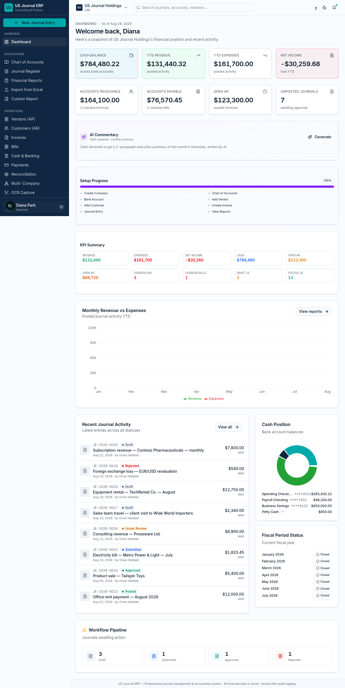

**Features:**
- **KPI Cards** — Cash Balance, YTD Revenue, YTD Expenses, Net Income, AR, AP, Unposted Journals
- **AI Commentary** — Click "Generate" to get a 2-paragraph executive summary written by GLM-4
- **Onboarding Progress** — 8-step setup wizard with auto-completion detection
- **KPI Summary Widget** — 10 key metrics in a grid (Revenue, Expenses, NI, Cash, AR, AP, Overdue counts, Draft/Posted JE)
- **Monthly P&L Chart** — Revenue vs Expenses trend (Jan–Dec)
- **Recent Journal Activity** — Latest entries across all statuses
- **Cash Position** — Bank account balances
- **Fiscal Period Status** — Open/closed periods
- **Workflow Pipeline** — Journals awaiting action by status

### 5.2 Chart of Accounts

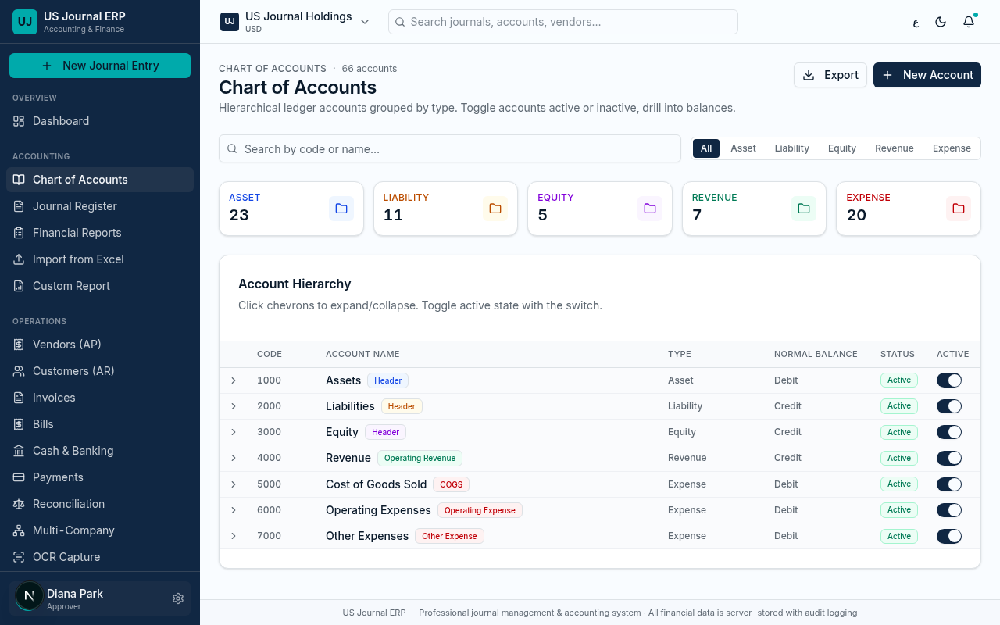

**Features:**
- 66-account hierarchical structure (US GAAP template)
- Filter by type: Asset, Liability, Equity, Revenue, Expense
- Toggle active/inactive (persists to database via PATCH API)
- Export to CSV
- Expand/collapse hierarchy tree
- Account type counters (23 Assets, 11 Liabilities, 5 Equity, 7 Revenue, 20 Expense)

### 5.3 Journal Register

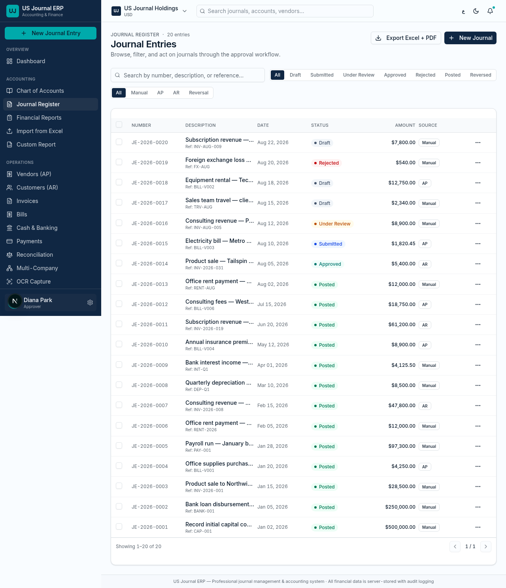

**Features:**
- Full journal entry lifecycle: Draft → Submitted → Under Review → Approved → Posted → Reversed
- Filter by status (Draft, Submitted, Posted, Reversed) and source (Manual, AP, AR, Reversal)
- Search by journal number, description, or reference
- Pagination (20 per page)
- Row actions: View details, Submit, Approve, Post, Reverse
- Bulk select + bulk action
- Export to Excel + PDF

### 5.4 New Journal Entry

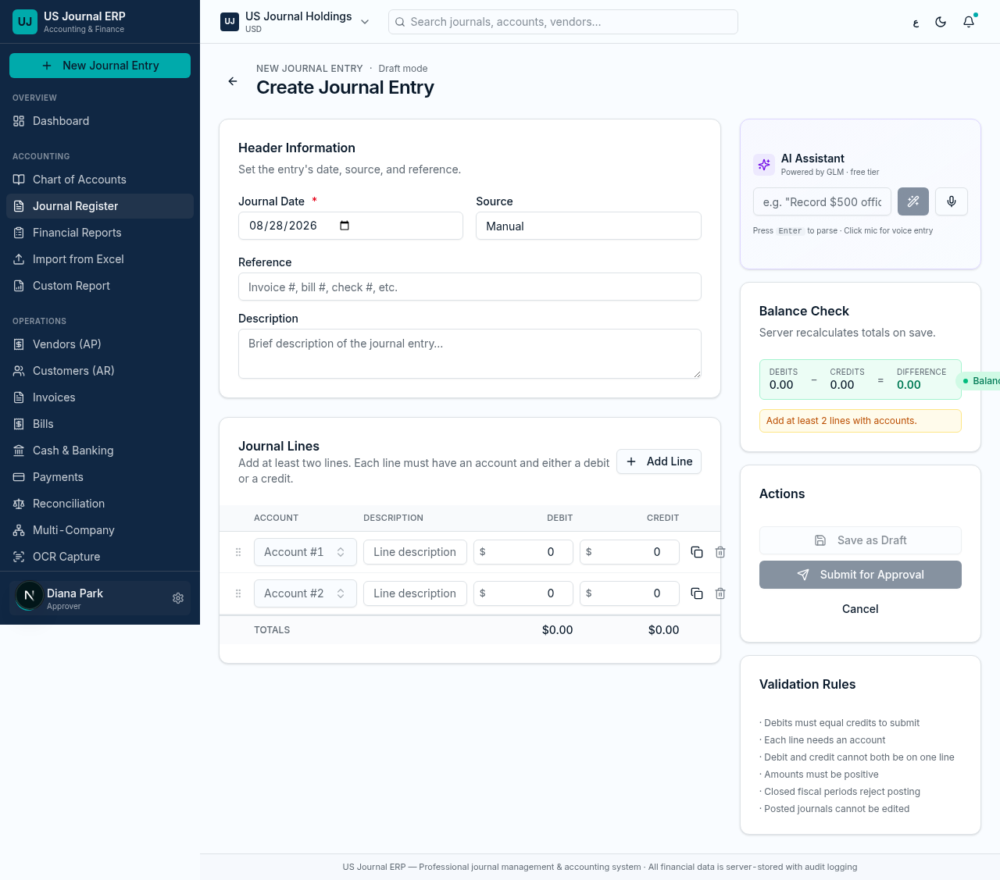

**Features:**
- Multi-line journal entry with debit/credit balancing
- **AI Assistant Panel** — Natural language input ("Record $500 office supplies from Staples paid with Visa") → auto-fills the journal
- **Voice Entry** — Click microphone, speak the instruction → AI transcribes and parses
- Account combobox with search
- Real-time balance indicator
- Server-side validation (balance, lines, date, currency, period, lock dates)
- Auto-rounding fix (1-cent tolerance)
- Save as Draft or Submit for Approval

### 5.5 Financial Reports

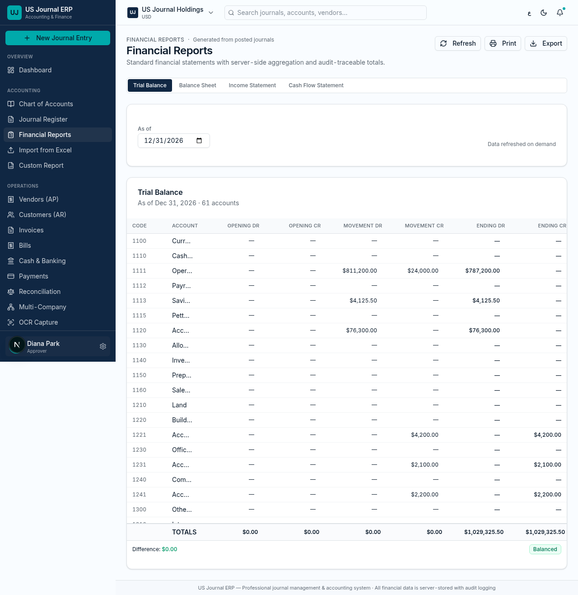

**Features:**
- **Trial Balance** — Per-account debit/credit with opening, movement, and ending balances
- **Balance Sheet** — Assets, Liabilities & Equity with contra-asset handling (accumulated depreciation)
- **Income Statement** — Revenue, COGS, Gross Profit, Operating Expenses, Net Income
- **Cash Flow Statement** — Indirect method (Net Income → Operating adjustments → Investing → Financing)
- All reports use the **shared financial calculations module** (`src/lib/finance.ts`) ensuring identical numbers
- Date range filtering with Refresh button
- Print and Export support

### 5.6 Vendors (Accounts Payable)

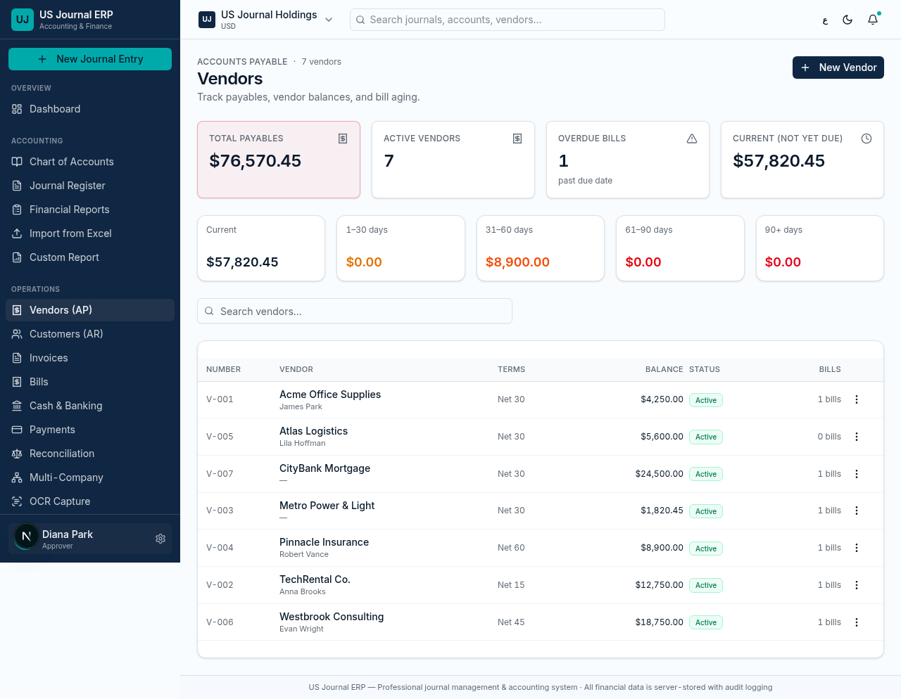

**Features:**
- Vendor management with contact info, payment terms, credit limit
- AP aging buckets (Current, 1–30, 31–60, 61–90, 90+ days)
- Row actions: View Stats (balance, open bills, overdue), Pay Vendor
- Search by name, number, email, phone
- Create new vendor dialog

### 5.7 Customers (Accounts Receivable)

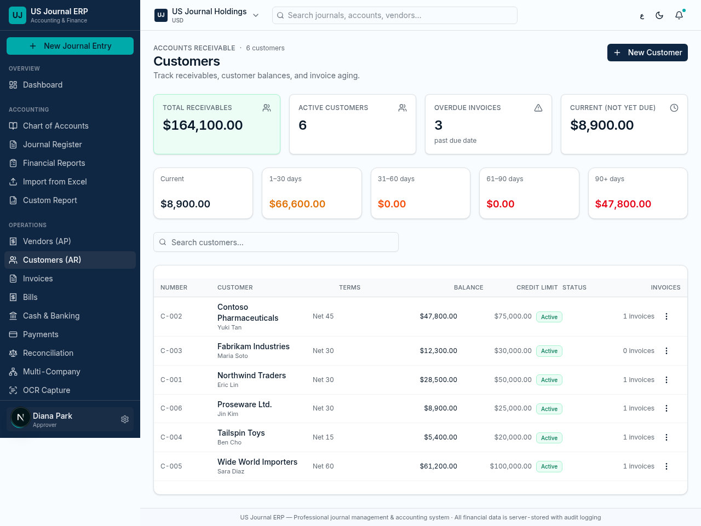

**Features:**
- Customer management with credit utilization indicator
- AR aging buckets
- Row actions: View Stats, Record Payment, Deactivate
- Search and filter

### 5.8 Invoices

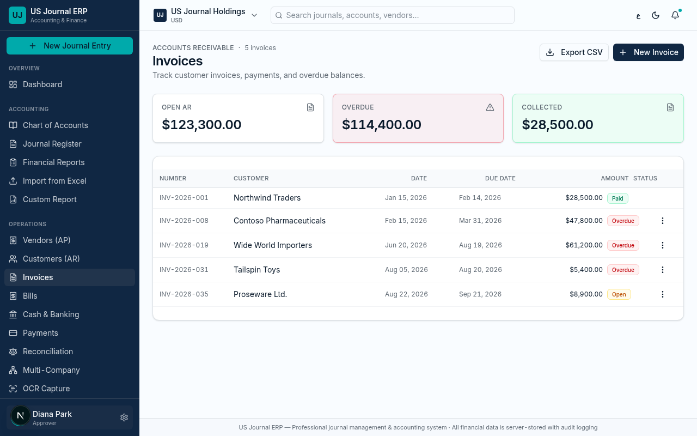

**Features:**
- Invoice lifecycle: Open → Posted → Paid
- Row actions: **Post to GL** (auto-creates journal entry with Dr AR / Cr Revenue / Cr Tax), **Record Payment** (auto-allocates payment, updates invoice status to Paid)
- KPIs: Open AR, Overdue amount, Collected amount
- Export to CSV (with customer names via nested path resolution)

### 5.9 Bills

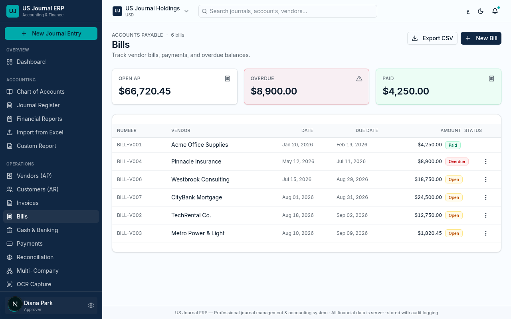

**Features:**
- Bill lifecycle: Open → Posted → Paid
- Row actions: **Post to GL** (auto-creates journal with Dr Expense / Cr AP), **Pay Bill** (auto-allocates payment)
- AP aging and overdue tracking

### 5.10 Banking

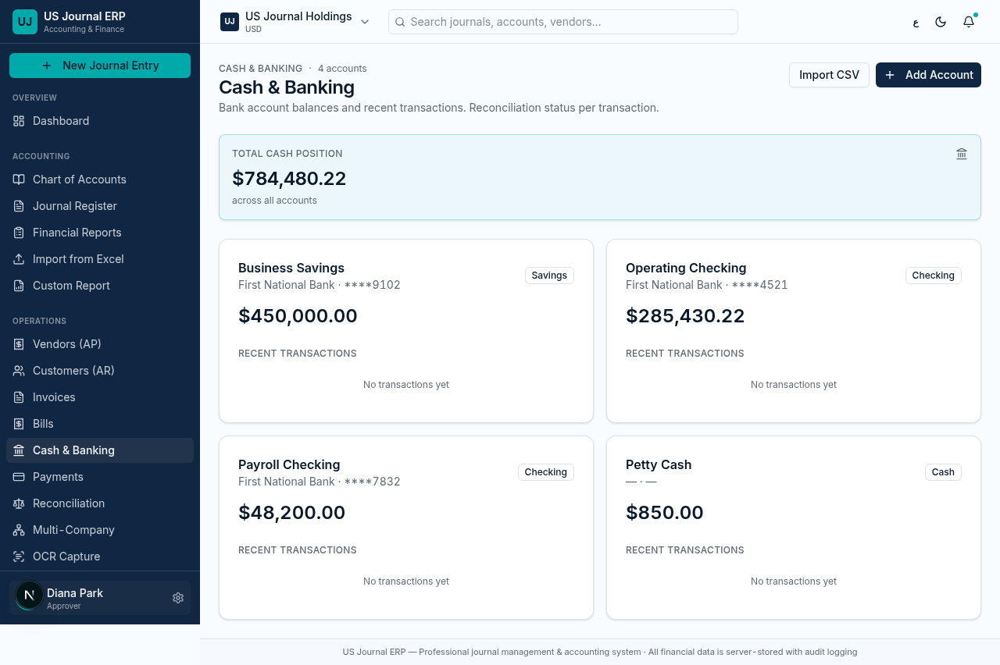

**Features:**
- Multiple bank accounts (Checking, Savings, Cash)
- Total cash position KPI
- Recent transactions per account
- **Import CSV** — Upload bank statement CSV to auto-create transactions
- Reconciliation status per transaction

### 5.11 Payments

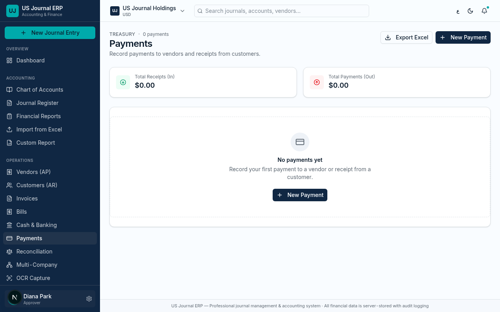

**Features:**
- Payment register (Receipts and Payments)
- Odoo-inspired payment allocation wizard (`/api/payments/register`)
- Auto-allocation (oldest-first) when no specific invoice/bill selected
- Updates invoice/bill status (Open → Partially Paid → Paid)
- Updates customer/vendor balance
- Creates bank transaction records

### 5.12 Organization Settings

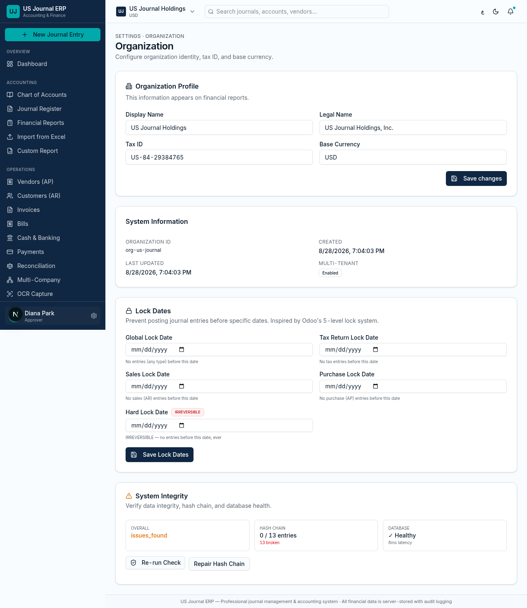

**Features:**
- Organization profile (name, legal name, tax ID, base currency)
- **Lock Dates** — 5-level lock system (Odoo-inspired):
  - Global Lock Date — blocks all entries
  - Tax Return Lock Date — blocks tax entries
  - Sales Lock Date — blocks AR entries
  - Purchase Lock Date — blocks AP entries
  - Hard Lock Date — IRREVERSIBLE, no exceptions
- **Integrity Check Panel** — Shows system health:
  - Overall status (healthy/issues_found)
  - Hash chain status (X/Y entries hashed)
  - Database latency
  - Repair Hash Chain button (when broken)
- Save settings to database (real API, not demo)

### 5.13 Fixed Assets

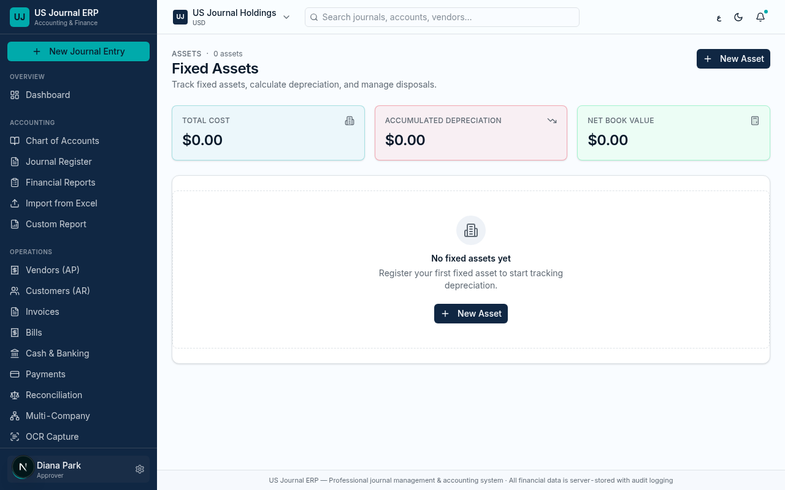

**Features:**
- Asset registration (cost, salvage value, useful life)
- Straight-line depreciation
- Row action: **Depreciate** — runs monthly depreciation, creates journal entry (Dr Depreciation Expense / Cr Accumulated Depreciation)
- Book value tracking

### 5.14 Payroll

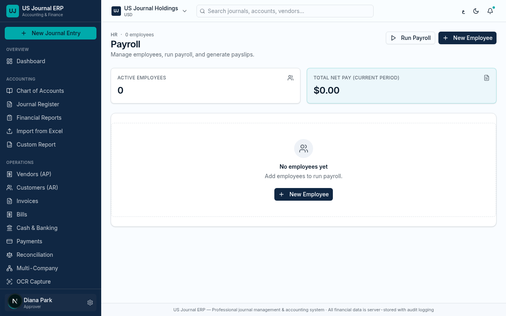

**Features:**
- Employee management (salary, allowances, deductions, tax rate)
- Run payroll — creates payslips for all active employees
- Row action: **View Payslip** — shows net pay and period
- Tax calculation: (basic + allowances) × tax rate

### 5.15 Audit Log

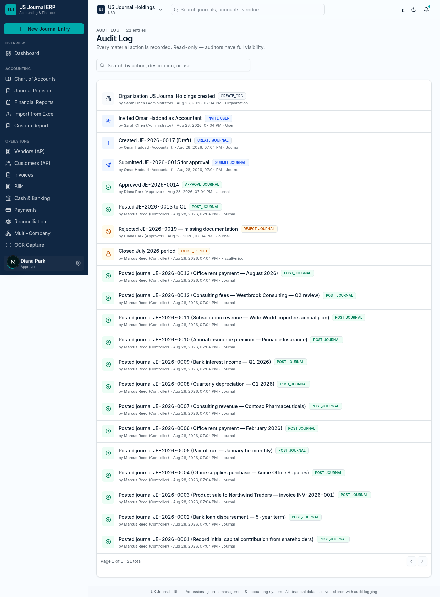

**Features:**
- Every material action recorded with hash chain
- Search by action, description, or user
- Shows: action type, user, timestamp, entity type
- Includes AI call audit trail (NL journal, OCR, commentary)

### 5.16 Additional Modules

| Module | Screenshot | Features |
|---|---|---|
| Inventory | 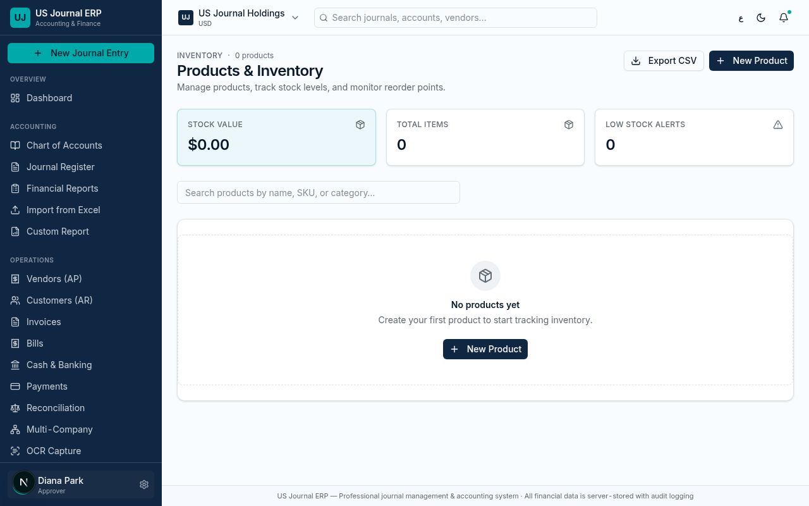 | Product management, stock levels, reorder points, cost/sale pricing, View Accounting row action |
| Budgets | 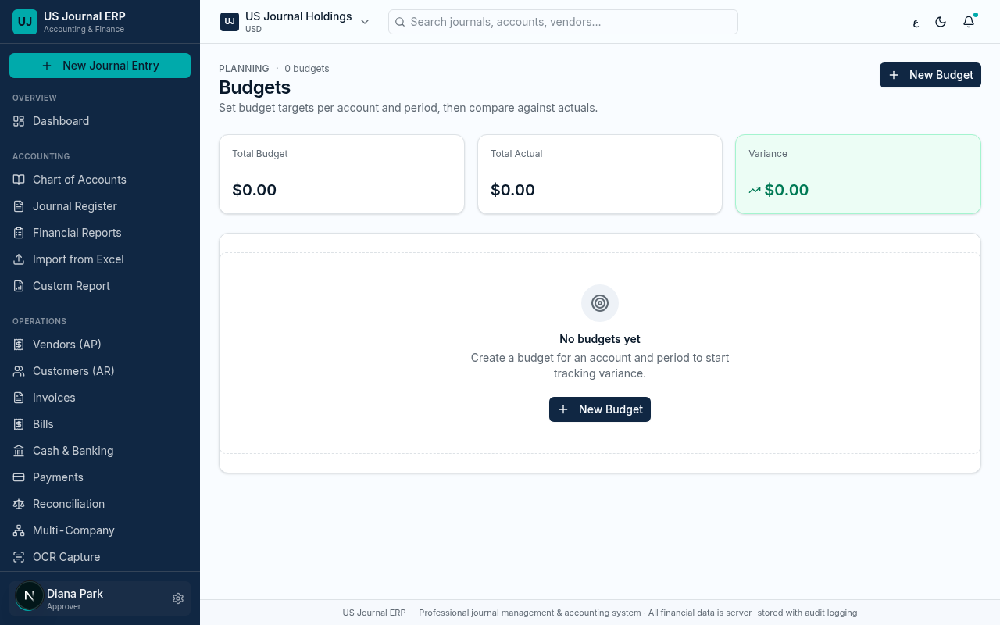 | Budget vs Actual tracking (actual computed from posted journal lines), variance calculation |
| OCR Capture | 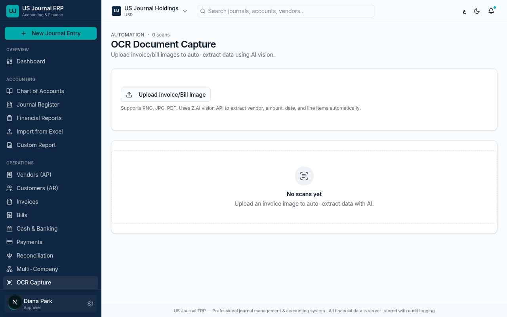 | Upload invoice images → GLM-4V extracts vendor, amount, date, line items automatically |
| Recurring Journals | — | Create recurring templates, Execute button per row, Execute All Due button |
| Reconciliation | — | Bank reconciliation sessions, auto-match transactions to invoices/bills |
| Cash Flow Forecast | — | 6-month projection based on open AR/AP and recurring journals |
| Period Close | — | 7-step close checklist, clickable items navigate to relevant pages |
| Fiscal Periods | — | Open/close fiscal years and periods, blocked periods reject postings |
| Exchange Rates | — | Multi-currency rate management |
| Custom Report Builder | — | Select accounts + date range → per-account Dr/Cr/Balance |
| Excel Import | — | Download template, upload Excel to create journals |

---

## 6. AI Integration

All AI features run on **GLM (Z.ai) free tier** — zero API keys, zero per-user cost.

### AI Features

| Feature | API Endpoint | Description |
|---|---|---|
| **Invoice OCR** | `POST /api/ocr-scan` | Upload invoice image → GLM-4V extracts vendor, amount, date, line items |
| **NL Journal Entry** | `POST /api/ai/nl-journal` | "Record $500 office supplies from Staples paid with Visa" → auto-creates balanced journal |
| **Anomaly Explanation** | `POST /api/ai/anomaly-explain` | Explains why an entry was flagged as anomalous in plain English |
| **Monthly Commentary** | `POST /api/ai/monthly-commentary` | Generates 2-paragraph CFO-grade executive summary of monthly financials |
| **Voice Journal** | `POST /api/ai/voice-journal` | Speak "Pay 5000 rent" → ASR transcribes → NL parser creates journal |
| **Vendor Enrichment** | `POST /api/ai/vendor-enrich` | Enter vendor name → web search + AI extracts legal name, tax ID, address, website |
| **Account Suggestion** | `POST /api/ai/suggest-account` | Enter transaction description → AI picks best matching GL account |

### AI Audit Trail

Every AI call is logged in the audit log with:
- Feature name (INVOICE_OCR, NL_JOURNAL, etc.)
- Model used (glm-4, glm-4v, glm-asr)
- Input preview
- Output preview
- Latency
- Success/failure status

---

## 7. Financial Reports

### Shared Calculation Engine

All 5 financial reports use `src/lib/finance.ts` as the single source of truth:

```
computeAccountBalances() → AccountBalance[]
    ↓
computeFinancialSummary() → {
    operatingRevenue, otherIncome, totalRevenue,
    costOfGoodsSold, operatingExpenses, otherExpenses,
    grossProfit, operatingIncome, netIncome,
    totalAssets, totalLiabilities, totalEquity
}
    ↓
computeCashFlow() → {
    netIncome, operatingAdjustments,
    cashFromOperating, cashFromInvesting, cashFromFinancing,
    netChange
}
```

### Consistency Guarantee

| Report | Revenue | Net Income |
|---|---|---|
| Dashboard | $131,440.32 | -$30,259.68 |
| Income Statement | $131,440.32 | -$30,259.68 |
| Balance Sheet | — | -$30,259.68 |
| Cash Flow | — | -$30,259.68 |
| Trial Balance | — | Balanced ✓ |

---

## 8. Odoo-Inspired Features

### Models Implemented (40+)

| Odoo Model | Our Module | Status |
|---|---|---|
| `account_move` | `invoice-autopost.ts` | ✅ Hash chain, lock dates, auto-post |
| `account_move_line` | `validation-engine.ts` | ✅ Validation, analytic, tax, reconcile |
| `account_tax` | `tax-engine.ts` | ✅ 4 types (percent/fixed/group/division) |
| `account_tax_repartition_line` | `tax-repartition.ts` | ✅ Multi-account tax split |
| `account_payment` | `/api/payments/register` | ✅ Allocation wizard |
| `account_payment_term` | `payment-terms.ts` | ✅ Multi-line, early payment discounts |
| `account_bank_statement` | `bank-import.ts` | ✅ CSV import, auto-match |
| `account_reconcile_model` | `/api/reconciliation/auto-match` | ✅ Auto-match rules |
| `account_partial_reconcile` | `reconciliation.ts` | ✅ Full/partial tracking |
| `account_fiscal_position` | `fiscal-position.ts` | ✅ Tax mapping by country |
| `account_cash_rounding` | `odoo-features.ts` | ✅ UP/DOWN/HALF-UP |
| `account_incoterms` | `odoo-features.ts` | ✅ 9 terms (EXW through DDP) |
| `account_lock_exception` | `lock-dates.ts` | ✅ 5 lock date levels |
| `account_report` | `finance.ts` | ✅ Shared calculation engine |
| `chart_template` | `odoo-features.ts` | ✅ US GAAP template |
| `sequence_mixin` | `journal-types.ts` | ✅ Collision-resistant numbering |
| `account_move_send` | `odoo-complete.ts` | ✅ Email/print/EDI/manual |
| `account_journal_dashboard` | `odoo-features.ts` | ✅ Per-journal KPIs |
| `account_payment_method` | `odoo-features.ts` | ✅ 10 methods |
| `account_account_tag` | `odoo-features.ts` | ✅ Tags for reporting |
| `res_partner` | `partner.ts` | ✅ Unified search/stats |
| `res_partner_bank` | `odoo-complete.ts` | ✅ Multiple bank accounts |
| `res_country_group` | `odoo-features.ts` | ✅ EU/GCC/NAFTA/MENA/ASEAN |
| `analytic` | `analytic.ts` | ✅ Dept/project/location distribution |
| `product_catalog_mixin` | `odoo-features.ts` | ✅ Product-based invoice lines |
| `uom_uom` | `odoo-complete.ts` | ✅ 19 UoM, 5 categories |
| `account_move_reversal` | `odoo-complete.ts` | ✅ Credit note wizard |
| `account_resequence` | `odoo-complete.ts` | ✅ Renumber journals |
| `merge_partner_automatic` | `odoo-complete.ts` | ✅ Partner deduplication |
| `structured_reference` | `odoo-complete.ts` | ✅ ISO 11649 creditor reference |
| `digest` | `odoo-complete.ts` | ✅ KPI email digest |
| `onboarding` | `odoo-complete.ts` | ✅ 8-step setup wizard |
| `res_config_settings` | `odoo-complete.ts` | ✅ Accounting configuration |
| `kpi_provider` | `odoo-complete.ts` | ✅ 14 KPIs |

---

## 9. Reliability & Security

### Server-Side Validation Engine (`validation-engine.ts`)

| Validator | Description |
|---|---|
| `checkBalanced()` | Debits must equal credits (>1 cent tolerance) |
| `validateLines()` | Min 2 lines, no both debit+credit, no negative amounts |
| `validateDate()` | Future date check, old date check, max future days |
| `validateCurrency()` | ISO code, exchange rate, extreme rate warning |
| `checkFiscalPeriod()` | Closed period blocks posting |
| `checkPostedEntryNotModified()` | Hashed entries are immutable |
| `checkNotReconciled()` | Can't modify reconciled lines |
| `autoFixRounding()` | Auto-adjust last line for 1-cent errors |

### Hash Chain Integrity

Every posted journal entry has a SHA-256 hash chained to the previous entry:

```
Journal 1: hash = SHA256(journal1_data + "")
Journal 2: hash = SHA256(journal2_data + Journal1.hash)
Journal 3: hash = SHA256(journal3_data + Journal2.hash)
```

- **`POST /api/journals/repair-hashes`** — Recomputes all hashes (full chain)
- **`GET /api/journals/hash-verify`** — Verifies integrity, returns broken entries
- **`GET /api/integrity-check`** — Comprehensive health check (data, hashes, DB, constraints)

### 5-Level Lock Dates

| Level | Field | Behavior |
|---|---|---|
| Hard | `hardLockDate` | IRREVERSIBLE — no entries before this date, ever |
| Global | `fiscalYearLockDate` | All entry types blocked |
| Tax | `taxLockDate` | Only entries with taxes blocked |
| Sales | `saleLockDate` | Only AR/sales entries blocked |
| Purchase | `purchaseLockDate` | Only AP/purchase entries blocked |

### Database Reliability (`db-reliability.ts`)

- **Circuit Breaker** — Stops hammering a failing database (5 failures → open, 30s → half-open)
- **Retry with Backoff** — Exponential backoff for P2002, SQLITE_BUSY, deadlocks
- **Atomic Transactions** — All multi-step operations wrapped in `db.$transaction` with timeout
- **Write Intent Log** — Records intent before executing (crash recovery)
- **Data Integrity Verification** — Checks balanced journals, orphaned lines, duplicate numbers

---

## 10. API Reference

### Core Endpoints (103 total)

#### Journals
| Method | Endpoint | Description |
|---|---|---|
| GET | `/api/journals` | List journals with filters |
| POST | `/api/journals` | Create journal entry |
| GET | `/api/journals/[id]` | Get journal detail |
| POST | `/api/journals/[id]/submit` | Submit for approval |
| POST | `/api/journals/[id]/approve` | Approve journal |
| POST | `/api/journals/[id]/post` | Post to general ledger |
| POST | `/api/journals/[id]/reverse` | Reverse journal |
| POST | `/api/journals/[id]/reject` | Reject journal |
| POST | `/api/journals/repair-hashes` | Repair hash chain |
| GET | `/api/journals/hash-verify` | Verify hash integrity |
| POST | `/api/journals/resequence` | Renumber journals |

#### Invoices & Bills
| Method | Endpoint | Description |
|---|---|---|
| GET/POST | `/api/invoices` | List/create invoices |
| POST | `/api/invoices/[id]/post` | Auto-post invoice to GL |
| GET/POST | `/api/bills` | List/create bills |
| POST | `/api/bills/[id]/post` | Auto-post bill to GL |
| POST | `/api/bills/autopost` | Auto-post due bills |

#### Payments
| Method | Endpoint | Description |
|---|---|---|
| GET/POST | `/api/payments` | List/create payments |
| GET/POST | `/api/payments/register` | Payment allocation wizard |
| GET | `/api/payments/register?partyType=CUSTOMER&partyId=X` | Get open invoices for customer |

#### Financial Reports
| Method | Endpoint | Description |
|---|---|---|
| GET | `/api/reports/trial-balance` | Trial balance |
| GET | `/api/reports/balance-sheet` | Balance sheet |
| GET | `/api/reports/income-statement` | Income statement |
| GET | `/api/reports/cash-flow` | Cash flow statement |

#### AI Endpoints
| Method | Endpoint | Description |
|---|---|---|
| POST | `/api/ai/nl-journal` | Natural language → journal entry |
| POST | `/api/ai/anomaly-explain` | Explain anomaly |
| POST | `/api/ai/monthly-commentary` | Monthly AI commentary |
| POST | `/api/ai/voice-journal` | Voice → journal entry |
| POST | `/api/ai/vendor-enrich` | Vendor web enrichment |
| POST | `/api/ai/suggest-account` | GL account suggestion |
| POST | `/api/ocr-scan` | Invoice OCR |

#### Odoo-Inspired Endpoints
| Method | Endpoint | Description |
|---|---|---|
| POST | `/api/credit-note` | Create credit note |
| POST | `/api/accrual` | Accrual/deferral entry |
| GET/PUT | `/api/lock-dates` | Get/set lock dates |
| POST | `/api/recurring-journals/execute` | Execute recurring journals |
| POST | `/api/reconciliation/auto-match` | Auto-match bank transactions |
| POST | `/api/banking/import` | Import bank statement CSV |
| POST | `/api/fx-revaluation` | Currency revaluation |
| POST | `/api/taxes/compute` | Tax computation |
| GET | `/api/integrity-check` | System health check |
| GET | `/api/kpi-summary` | 14 KPI metrics |
| GET | `/api/onboarding` | Setup progress |
| GET | `/api/config` | Accounting configuration |
| GET | `/api/digest` | KPI digest |

---

## 11. Database Schema

### 53 Prisma Models

```
Core:          Organization, User, Session, Membership
Accounting:    Account, Journal, JournalLine, JournalApproval, FiscalYear, FiscalPeriod
AR/AP:         Customer, Vendor, Invoice, InvoiceLine, Bill, BillLine
Banking:        BankAccount, BankTransaction, Reconciliation, Allocation
Payments:      Payment, PaymentMethod
Commerce:      Product, Warehouse, InventoryMove, PurchaseOrder, SalesOrder
Planning:      Budget, RecurringJournal, ExchangeRate, CashFlowForecast
Assets:        FixedAsset, DepreciationRecord
HR:            Employee, Payslip, Timesheet
Manufacturing:  BOM, BOMLine, ProductionOrder
Multi-company:  Subsidiary, IntercompanyTxn
System:        AuditLog, CustomField, CustomFieldValue, Document, Notification
OCR:           OcrScan
Tax:           TaxCode
Dimensions:     Department, Location, Project
```

### Key Schema Features

- **Money as Int** — All monetary values stored as cents (Int) to avoid floating-point drift
- **Hash Chain** — `Journal.inalterableHash` (SHA-256)
- **Lock Dates** — `Organization.fiscalYearLockDate`, `taxLockDate`, `saleLockDate`, `purchaseLockDate`, `hardLockDate`
- **Multi-tenant** — Every model has `organizationId` for isolation
- **Audit Trail** — `AuditLog` model with `prevHash` and `hash` fields for tamper detection

---

## 12. User Guide

### Getting Started

1. **Open the app** — Navigates directly to dashboard (auth disabled for desktop mode)
2. **Dashboard** — View KPIs, generate AI commentary, check onboarding progress
3. **Chart of Accounts** — Review 66 pre-seeded accounts, toggle active/inactive
4. **Create Journal** — Click "New Journal Entry" or press Ctrl+N, use AI for natural language input
5. **Submit → Approve → Post** — Follow the journal workflow
6. **Invoices** — Create invoice, click "..." → Post to GL or Record Payment
7. **Bills** — Create bill, click "..." → Post to GL or Pay Bill
8. **Reports** — View Trial Balance, Balance Sheet, Income Statement, Cash Flow
9. **Organization** — Configure lock dates, run integrity check, save settings

### Keyboard Shortcuts

| Shortcut | Action |
|---|---|
| Ctrl+N | New Journal Entry |
| Ctrl+D | Dashboard |
| Ctrl+J | Journal Register |
| Ctrl+A | Chart of Accounts |
| Ctrl+R | Financial Reports |

### Row Actions

Every list view has a "..." dropdown per row:

| View | Actions |
|---|---|
| Invoices | Post to GL, Record Payment |
| Bills | Post to GL, Pay Bill |
| Customers | View Stats, Record Payment, Deactivate |
| Vendors | View Stats, Pay Vendor |
| Fixed Assets | Depreciate |
| Payroll | View Payslip |
| Inventory | View Accounting |
| Journal Detail | Create Credit Note (on Posted journals) |
| Recurring Journals | Execute |

---

## 13. Deployment

### Desktop App (Electron)

```bash
# Build for current platform
npm run build

# Build Windows installer
node scripts/build-windows-portable.js

# Build Linux AppImage
npm run electron:linux
```

Installers saved to `download/`:
- `USJournalERP-Windows-Portable.zip`
- `USJournalERP-1.0.0.AppImage`
- `USJournalERP-1.0.0-x64.tar.gz`

### Web Deployment

```bash
# Standard Next.js deployment
npm run build
npm start

# Or deploy to Vercel
vercel --prod
```

### Database

- **Desktop**: SQLite file at `db/custom.db` (auto-created on first run)
- **Cloud**: Set `DATABASE_URL` to PostgreSQL connection string
- **Schema sync**: `npx prisma db push`
- **Seed data**: `bun run seed`

---

## 14. Comparison with Odoo

| Feature | US Journal ERP | Odoo |
|---|---|---|
| **AI Invoice OCR** | ✅ Free (GLM-4V) | ❌ Requires paid Odoo.ai |
| **AI NL Journal** | ✅ Free (GLM-4) | ❌ Not available |
| **AI Voice Journal** | ✅ Free (GLM ASR) | ❌ Not available |
| **AI Monthly Commentary** | ✅ Free (GLM-4) | ❌ Not available |
| **Desktop App** | ✅ Electron (Win/Mac/Linux) | ❌ Web only |
| **Cost** | $0 forever | $24+/user/month |
| **Code Size** | ~28K lines | ~110K lines (account module) |
| **Report Consistency** | ✅ Shared engine | ⚠️ Sometimes diverges |
| **Hash Chain** | ✅ All posted journals | ✅ Secure journals only |
| **Lock Dates** | ✅ 5 levels | ✅ 5 levels |
| **Tax Engine** | ✅ 4 types + repartition | ✅ 4 types + repartition |
| **Payment Allocation** | ✅ Auto + manual | ✅ Auto + manual |
| **Bank Reconciliation** | ✅ Auto-match + manual | ✅ Auto-match + manual |
| **Recurring Entries** | ✅ Monthly/Quarterly/Yearly | ✅ Monthly/Quarterly/Yearly |
| **Multi-currency** | ✅ FX revaluation | ✅ FX revaluation |
| **Analytic Accounting** | ✅ Dept/Project/Location | ✅ Multi-plan |
| **Fiscal Positions** | ✅ Country-based | ✅ Full mapping table |
| **Audit Trail** | ✅ Hash chain | ✅ Hash chain |
| **Tests** | ❌ 0 test files | ✅ 72 test files |
| **Authentication** | ⚠️ Disabled (desktop mode) | ✅ Full RBAC |
| **PDF Reports** | ⚠️ Basic (window.print) | ✅ QWeb templates |
| **Email Sending** | ⚠️ Templates only | ✅ Full mail.thread |
| **Cron Jobs** | ⚠️ Manual trigger | ✅ Automated |

---

## License

This project is licensed under the MIT License — see the [LICENSE](LICENSE) file for details.

---

## Repository

- **GitHub**: [https://github.com/mahmoudmohamedxx1-hue/US-Journal-ERP](https://github.com/mahmoudmohamedxx1-hue/US-Journal-ERP)
- **Default Branch**: `main`
- **Latest Version**: v8.0
